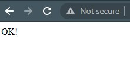

<link rel='stylesheet' href='../assets/css/main.css'/>

# Lab - Horizontal Scale Up

## Overview

On this lab you will learn an automated approach to increase or decrease the compute, memory or networking resources they have allocated.

**Note:**

- This lab requires you to open multiple terminal sessions.
- You have to install metric-server on top of your k8 cluster we covered that on [metric-server](../metric-server)

## Duration

35 minutes

## Dependencies

- This lab depends on [metric-server](../metric-server)

- change the working directory

```bash
$ cd ~/kubernets-labs/autoscale
```

## Step 1 - Deployment

inspect  [deployment file](deployment.yaml)

we are creating a `php-apache` deployment from Google's repository.

**Note:**

- This is a special image, when you open a page, an intense calculation will be executed to generate cpu load.

look at this part:

```console
resources:
    requests:
        cpu: 500m # 0.5 of a core
         memory: 100M
```

In this scenario, we are limiting the pods to use only half of a single core to achieve high load on cpu core easier.

apply the file

```bash
$   kubectl apply -f deployment.yaml
```

output

```console
deployment.apps/php-apache created
```

verify deployment

```bash
$ kubectl get deployment
```

output

```console
NAME         READY   UP-TO-DATE   AVAILABLE   AGE
php-apache   1/1     1            1           28s
```

verify pods

```bash
$ kubectl get pods
```

output

```console
NAME                          READY   STATUS    RESTARTS   AGE
php-apache-7bc7b7f897-bhr5d   1/1     Running   0          59s
```

## Step 2 - Service

expose the deployment using `LoadBalancer`

```bash
$   kubectl apply -f service.yaml
```

output will look like:

```console
service/php-apache-service created
```

verify

```bash
$   kubectl get svc
```

output

```console
NAME                 TYPE           CLUSTER-IP       EXTERNAL-IP          PORT(S)        AGE
kubernetes           ClusterIP      10.100.0.1       <none>               443/TCP        43m
php-apache-service   LoadBalancer   10.100.186.232   <YOUR-ACCESS-LINK>   80:31799/TCP   23s
```

Try to open the link in `EXTERNAL-IP`

**Note:**

- It could take upto 10 minutes to get `EXTERNAL-IP` and be able to open it.

result of the opening the link would look like:



## Step 3 - Pod usage

execute the following command to get list of pods and their cpu/ram usage

```bash
$ kubectl top pods
```

output

```console
NAME                          CPU(cores)   MEMORY(bytes)
php-apache-7bc7b7f897-bhr5d   1m           10Mi
```

This means your pod is almost idle.

---
<span style="color:red">**IMPORTANT**</span> 

if you are getting the following error, it means that you skipped the `metric-server` lab

```console
error: Metrics API not available
```
---


## Step 4 - Generate Load

**IMPORTANT:** <span style="color:red"> OPEN A NEW TERMINAL SESSION FOR THIS STEP </span>

now, we are going to create a pod with busybox image, connect to it, and try to stress the deployment.

```bash
$ kubectl run -i --tty load-generator --image=busybox /bin/sh

#Hit enter for command prompt

$ while true; do wget -q -O- <YOUR-SERVICE-URL>; done
```

output will give you lots of `OK!`

<span style="color:red"> KEEP THE TERMINAL OPEN </span>

Switch to your main terminal and try to get the load of your pods

```bash
$ kubectl top pods
```

output

```console
NAME                          CPU(cores)   MEMORY(bytes)
load-generator                9m           0Mi
php-apache-7bc7b7f897-bhr5d   883m         13Mi
```

as you can see, the load on our deployment pods is very high, time to scale up the deployment automatically.

## Step 5 - Scale Up

inspect  [autoscale file](autoscale.yaml)

note the following lines:

```console
  minReplicas: 1
  maxReplicas: 10
  targetCPUUtilizationPercentage: 50
```

using these settings we are telling k8 to to spawn a pod once current pods hit 50% cpu usage.  
maximum of 10 pods will be created and if a pod's usage is below 50%, k8 will de-spawn that pod, but it will keep 1 pod active

apply

```bash
$ kubectl apply -f autoscale.yaml
```

output

```console
horizontalpodautoscaler.autoscaling/php-apache created
```

verify hpa

```bash
$ kubectl get hpa
```

output

```console
NAME         REFERENCE               TARGETS   MINPODS   MAXPODS   REPLICAS   AGE
php-apache   Deployment/php-apache   198%/50%   1         10        4          69s
```

as you can see, cpu load is very high, k8 will try to lower the load on the cluster by spawning more pods

**Note:** it could take a while to see the new pods.

```bash
$ kubectl get pods
```

output

```console
NAME                          READY   STATUS    RESTARTS   AGE
load-generator                1/1     Running   0          12m
php-apache-7bc7b7f897-4wczk   1/1     Running   0          2m13s
php-apache-7bc7b7f897-72kfc   1/1     Running   0          2m13s
php-apache-7bc7b7f897-bhr5d   1/1     Running   0          32m
php-apache-7bc7b7f897-c2hsl   1/1     Running   0          2m13s
```

## Step 6 - Scale Down

Let's do the opposite of what we just did, lower the load to scale down.

Kill the `load-generator` pod.

```bash 
$ kubectl delete pods load-generator
```

output

```console
pod "load-generator" deleted
```

_wait for a few minutes_

check hpa

```bash
$ kubectl get hpa
```

output

```console
NAME         REFERENCE               TARGETS   MINPODS   MAXPODS   REPLICAS   AGE
php-apache   Deployment/php-apache   29%/50%   1         10        4          18m
```

Load is going down, k8 will start to de-spawn pods slowly.

_Wait for a few minutes_

This waiting time is called `cooldown delay` to prevent excessive scale up/down.

check your pods configuration

```bash
$ kubectl get pods
```

output

```console
NAME                          READY   STATUS    RESTARTS   AGE
php-apache-7bc7b7f897-bhr5d   1/1     Running   0          55m
```

since load is very low, only one pod is working.


## Well done! 👏