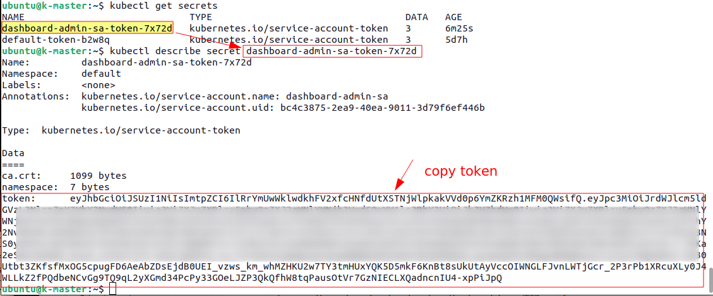
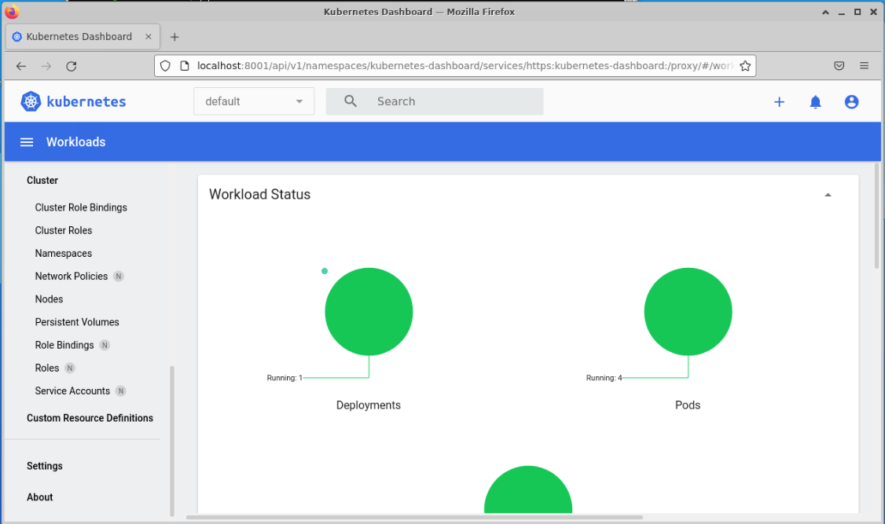

<link rel='stylesheet' href='../assets/css/main.css'/>

# Accessing Kubernetes Dashboard

## Overview

Let's see some UI.  It is a bit of work to get the dashboard working.  But it is worth it!

## Duration 

20 mins

**Note: All the commnads are executed on the master node**

## Step-1: Create a Dashboard Controller

The following will install dashboard components

```bash
$   kubectl create -f https://raw.githubusercontent.com/kubernetes/dashboard/master/aio/deploy/recommended/kubernetes-dashboard.yaml
```

Look at the pods running

```bash
$   kubectl get pods -A
```

## Step-2: Create a Dashboard User

```bash
$   kubectl create serviceaccount dashboard-admin-sa

$   kubectl create clusterrolebinding dashboard-admin-sa \
    --clusterrole=cluster-admin --serviceaccount=default:dashboard-admin-sa

$   kubectl get secrets
```

You will see output like this

```console
NAME                             TYPE                                  DATA   AGE
dashboard-admin-sa-token-7x72d   kubernetes.io/service-account-token   3      6m25s
default-token-b2w8q              kubernetes.io/service-account-token   3      5d7h
```

Get the token  starting with `dashboard-admin-sa-token`.  The full name will be unique to you.  Use yours

```bash
## substitute 7x72d with yours
$   kubectl describe secret dashboard-admin-sa-token-7x72d
```

It will print out the token.  Copy the token.   See screenshot below



## Step-3: Start KubeProxy

```bash
$   kubectl proxy
```

You will see an output like

```console
Starting to serve on 127.0.0.1:8001
```

## Step-4: Open Browser

Access the UI environemnt and launch a browser

Go the following URL

`http://localhost:8001/api/v1/namespaces/kubernetes-dashboard/services/https:kubernetes-dashboard:/proxy/`

When prompted, enter the **token** you copied from previous step

## Step-5: Whew.. Enjoy a nice UI!

