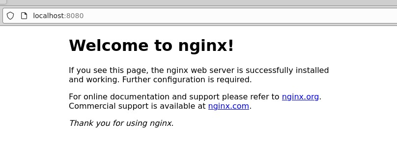

<link rel='stylesheet' href='../assets/css/main.css'/>

# Lab - Service manifest


## Overview

In this lab you will how to create a service and access your cluster using that service.


## Duration
20 minutes


## Step 1 - Deploy


[deployment-nginx.yaml](deployment-nginx.yaml)

Deploy 

```bash
$   cd ~/kubernets-labs/service-nginx
$   kubectl apply -f deployment-nginx.yaml
```


## Step 2 - Service manifest file

inspect  [service-nginx.yaml](service-nginx.yaml)

## Step 3 - Apply service file

Apply the config files using `kubectl apply` command

```bash
$   cd ~/kubernets-labs/service-nginx
$   kubectl apply -f service-nginx.yaml
```

output will look like:
```console
service/nginx-service created
```

## Step 4 - get list of services

run the following command to get list of services on your cluster

```bash
$ kubectl get services
```

output will look like:

```console
NAME            TYPE        CLUSTER-IP    EXTERNAL-IP   PORT(S)          AGE
kubernetes      ClusterIP   10.96.0.1     <none>        443/TCP          5d5h
nginx-service   NodePort    10.99.46.93   <none>        8080:30007/TCP   61s
```

## Step 4 - access cluster

On terminal you can use

```bash
# replace nodeIP with your node's IP address
$   curl  nodeIP:30007/
```

If you have access to an UI environment, open a browser and open any of the nodes in the cluster with port `30007`

`http://nodeIP:30007/`

output should look like:




## Step 5 - Delete services

Use the following command to delete your service;

```bash
kubectl  delete service nginx-service
```

output

```console
service "nginx-service" deleted
```


## Lab is done! 👏
